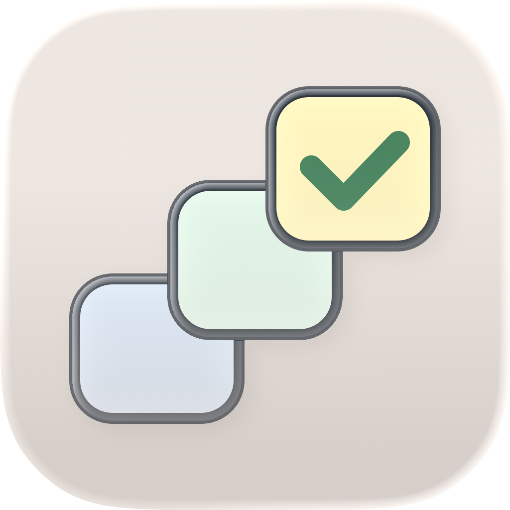
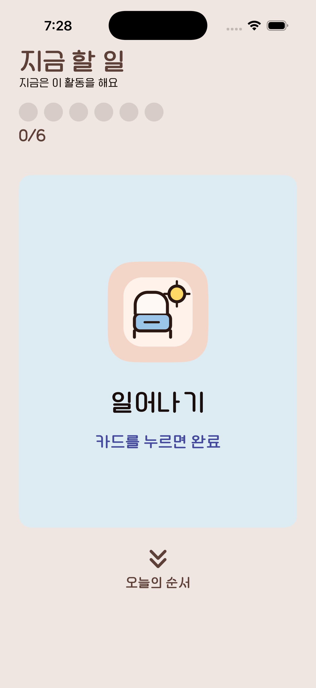
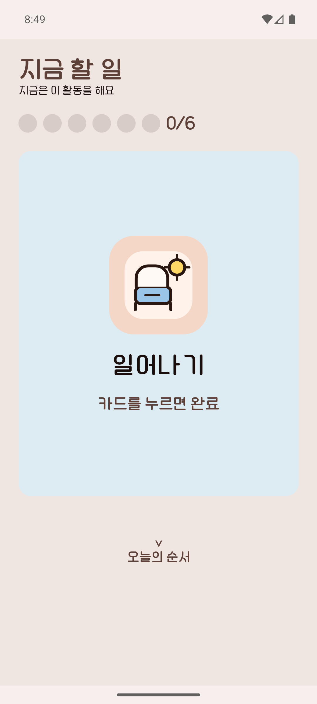
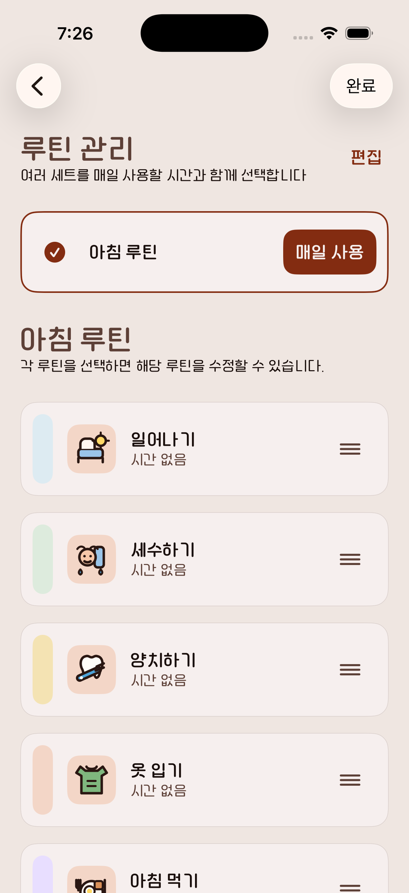
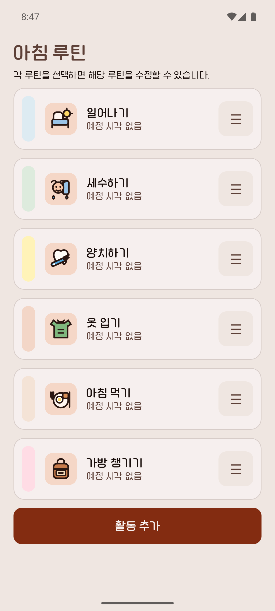
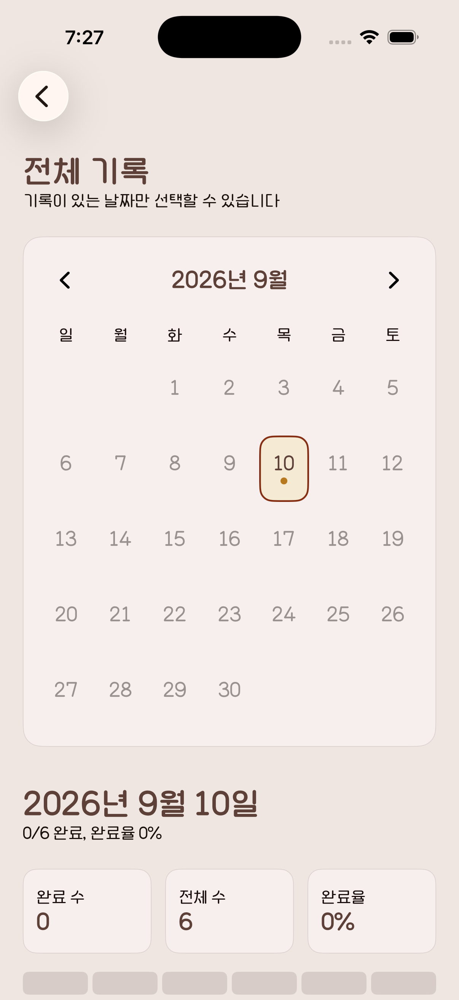
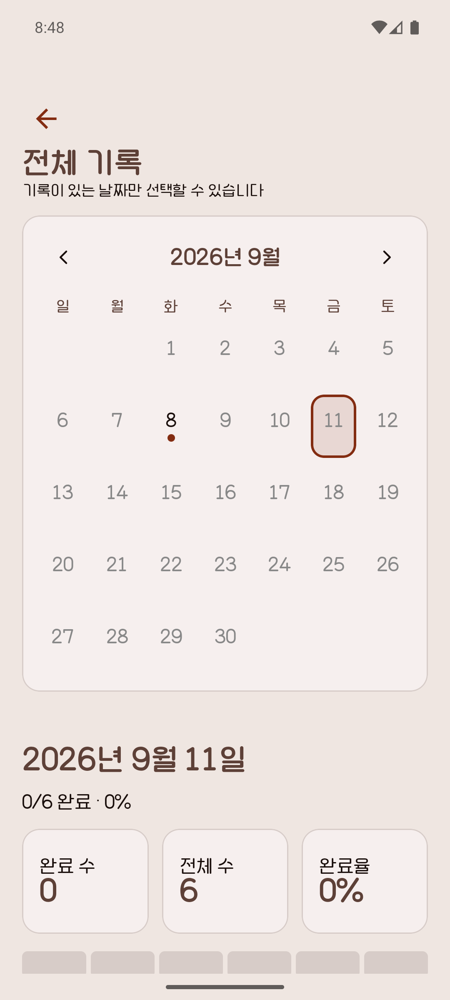
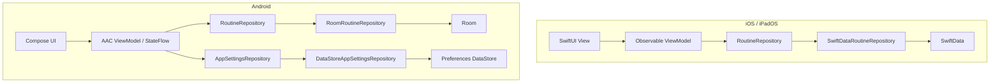

<div align="center">
  
  <h1>차례차례 · Steppie</h1>
  <p><strong>지금 할 일을 하나씩, 하루의 순서를 눈에 보이게.</strong></p>
  <p>그림과 색상, 짧은 문구로 하루 일과를 따라갈 수 있도록 돕는 루틴 시각화 앱</p>
  <p>
    <a href="https://apps.apple.com/kr/app/id6799095495">
  </p>
  <p>
    
    
    
    
    
    
    
    
  </p>
</div>

발달장애·자폐 스펙트럼 사용자가 다음 활동을 예측하고, 한 번의 탭으로 완료를 표현할 수 있도록 만들었습니다. 보호자·교사·치료사는 보호자 모드에서 활동과 순서를 구성하고 진행 기록을 확인할 수 있습니다.

같은 제품 요구사항을 바탕으로 **iOS/iPadOS와 Android를 각각 네이티브 앱으로 개발**했습니다. 루틴과 진행 기록은 기기의 로컬 저장소에서 관리합니다.

## 프로젝트 정보

| 항목 | 내용 |
|---|---|
| 개발 기간 | 2026.07–2026.08 |
| 개발 인원 | 1명 |
| 담당 범위 | 프로젝트 전체 — 기획, 디자인, iOS/iPadOS·Android 개발 |
| 지원 플랫폼 | iPhone · iPad · Android 스마트폰 · Android 태블릿 |
| 최소 지원 버전 | iOS/iPadOS 18.6 · Android API 28 |

## 주요 화면

<table>
  <thead>
    <tr><th>iOS / iPadOS</th><th>Android</th></tr>
  </thead>
  <tbody>
    <tr><th colspan="2">지금 할 일</th></tr>
    <tr>
      <td valign="top"></td>
      <td valign="top"></td>
    </tr>
    <tr><th colspan="2">루틴 관리</th></tr>
    <tr>
      <td valign="top"></td>
      <td valign="top"></td>
    </tr>
    <tr><th colspan="2">진행 기록</th></tr>
    <tr>
      <td valign="top"></td>
      <td valign="top"></td>
    </tr>
  </tbody>
</table>

같은 아침 루틴 템플릿의 6개 활동을 구성한 실제 앱 화면. Android 루틴 관리는 활동 목록까지 스크롤한 상태.

## 주요 기능

| 기능 | 사용자 경험 |
|---|---|
| 지금 할 일과 오늘의 순서 | 현재 활동은 큰 카드로, 전체 순서는 목록으로 확인 |
| 완료와 되돌리기 | 포커스 카드 탭으로 완료, 완료 피드백에서 실수로 누른 활동 되돌리기 |
| 맞춤 루틴 구성 | 템플릿 또는 직접 만든 루틴에 아이콘·사진·색상·예정 시각을 설정 |
| 날짜별 진행 기록 | 날짜를 선택해 루틴별 완료 현황 확인 |
| 보호자 모드 | 숨은 진입 영역과 PIN으로 루틴 편집·설정 화면을 분리 |
| 음성·감각 피드백과 알림 | 음성 안내, 효과음, 진동, 피드백 강도와 예정 활동의 예고 알림 설정 |
| 파일 백업·복원 | 루틴·진행 기록·설정·사진을 ZIP으로 내보내고 파일에서 복원 |

## 기술적 고려사항

### 1. 같은 제품 경험을 두 네이티브 구현으로 유지하기

플랫폼마다 화면과 저장 방식을 따로 구현하면 활동 순서, 완료 상태, 백업 데이터의 의미가 달라질 수 있는 문제. 이를 줄이기 위해 [제품 명세](docs/product-spec.md), [데이터 계약](docs/data-contract.md), [디자인 토큰](docs/design-tokens.md), [현지화 계약](docs/localization-contract.md)을 공통 기준으로 적용.

| iOS / iPadOS | Android |
|---|---|
| SwiftUI 화면과 `@Observable` 상태 관리, 도메인 모델을 SwiftData 영속 모델로 변환 | Compose 화면과 AAC ViewModel·StateFlow, 도메인 모델을 Room 엔티티로 변환 |
| `RoutineRepository` 프로토콜로 저장소 경계 정의 | `RoutineRepository`와 `AppSettingsRepository` 인터페이스로 루틴·설정 저장소 경계 정의 |

제품 계약은 공유하고, 실행 코드는 각 플랫폼의 UI·수명주기·저장 API에 맞춰 구성. 변경 사항 검토 시 [공통 테스트 시나리오](docs/test-scenarios.md)를 기준으로 두 구현 비교.

구현: [iOS 저장소와 매핑](ios/Steppie/Steppie/Data/Routine) · [Android 저장소](android/app/src/main/java/com/example/steppie/data/repository)

### 2. 완료 피드백과 실제 진행 상태를 함께 관리하기

완료 직후 방금 끝낸 활동 표시, 되돌리기와 다음 활동 이동 처리. 선택된 활동·완료된 활동·피드백 중인 활동을 별도 상태로 관리.

| iOS / iPadOS | Android |
|---|---|
| `ChildRoutineViewModel`이 완료·되돌리기 상태를 관리하고, `ChildRoutinePolicy`가 현재 활동과 다음 루틴을 계산 | `combine`으로 설정·해당 날짜의 루틴·완료 기록·현재 시각을 결합해 화면 상태를 계산 |
| 예약 전환과 피드백 전환의 `Task`를 취소·재생성하며, 앱 활성화 시 진행 상태를 다시 확인 | `StateFlow`의 화면 상태와 `SharedFlow`의 음성·진동 이벤트를 분리하고, 저장 실패 시 낙관적으로 바꾼 완료 상태를 복구 |

진행 기록은 로컬 날짜 기준 조회. 루틴 삭제 시 삭제 시각을 남겨 기록이 참조하는 루틴 정보 유지.

구현: [iOS 진행 상태](ios/Steppie/Steppie/Features/ChildRoutine/ChildRoutineViewModel.swift) · [Android 진행 상태](android/app/src/main/java/com/example/steppie/ui/child/ChildRoutineViewModel.kt)

### 3. 데이터와 사진을 함께 검증하고 복원하기

사진이 포함된 백업은 데이터베이스만으로 복원할 수 없는 구조. [백업 계약](docs/backup-contract.md)에 따라 `manifest.json`, `data.json`, 사진 에셋을 ZIP으로 묶고, 데이터의 SHA-256 체크섬과 참조 관계를 검증한 뒤 현재 데이터 교체.

| iOS / iPadOS | Android |
|---|---|
| SwiftUI `fileExporter`·`fileImporter`로 백업 파일 저장·선택 | `CreateDocument`·`OpenDocument`로 백업 파일 저장·선택 |
| SwiftData 저장 실패 시 `ModelContext.rollback()`을 호출하고, 사진 변경 실패를 포함한 복원 오류에서는 기존 사진을 되돌리는 처리 수행 | Room·DataStore·사진 저장소를 복원 단계로 구성하고, 실패하면 적용한 단계를 역순으로 복구 |

백업 UI는 파일 내보내기·선택 방식이며, 복원은 기존 데이터를 교체하는 **Replace 방식**. 백업 검증과 저장소별 복구 처리를 분리해 손상된 파일과 복원 중 저장 오류에 대응.

구현: [iOS 백업 서비스](ios/Steppie/Steppie/Data/Backup/BackupService.swift) · [Android 복원 데이터 소스](android/app/src/main/java/com/example/steppie/data/backup/BackupDataSource.kt) · [Android 복구 순서](android/app/src/main/java/com/example/steppie/data/backup/BackupRestoreTransaction.kt)

### 4. 감각 피드백과 화면 구성을 사용자에게 맞추기

사용자별 부담을 고려한 음성 안내·효과음·진동·피드백 강도 조절. iOS는 `AVSpeechSynthesizer`, Android는 `TextToSpeech`를 사용하고 음성 속도와 볼륨 설정을 전달. 장식성 애니메이션은 iOS의 `accessibilityReduceMotion`, Android의 애니메이터 배율 설정에 따라 표시 여부와 강도 조절.

아이 모드의 주요 조작에 80pt/dp 터치 영역 토큰 적용. 스마트폰에서는 현재 활동에 집중하고, 넓은 화면에서는 목록과 포커스 카드를 함께 표시. iOS는 가용 너비, Android는 가용 너비와 가로 배치 조건으로 분할 화면 결정.

구현: [iOS 피드백](ios/Steppie/Steppie/Features/ChildRoutine/RoutineFeedbackServices.swift) · [Android 피드백](android/app/src/main/java/com/example/steppie/ui/app/AndroidFeedbackController.kt) · [iOS 레이아웃](ios/Steppie/Steppie/Features/ChildRoutine/ChildRoutineLayoutView.swift) · [Android 레이아웃](android/app/src/main/java/com/example/steppie/ui/child/ChildRoutineLayoutHost.kt)

## 아키텍처와 기술 스택

두 플랫폼 모두 MVVM을 기반으로 화면 상태와 저장소 분리. 아래는 핵심 루틴·설정 데이터 흐름이며, 공통 계약 문서는 개발과 검증의 기준.



| 영역 | iOS / iPadOS | Android |
|---|---|---|
| 언어·UI | Swift · SwiftUI | Kotlin · Jetpack Compose · Material 3 |
| 상태 관리 | `@Observable` · `@MainActor` | AAC ViewModel · StateFlow · SharedFlow |
| 영속화 | SwiftData | Room · Preferences DataStore |
| 비동기 처리 | Swift Concurrency | Kotlin Coroutines · Flow |
| 음성 안내 | AVSpeechSynthesizer | TextToSpeech |
| 로컬 알림 | UserNotifications | AlarmManager · BroadcastReceiver |
| 파일 백업 | SwiftUI 파일 가져오기·내보내기 | Storage Access Framework |
| 테스트 도구 | Swift Testing · XCTest | JUnit · Coroutines Test · Compose UI Test · Room Testing |

## 저장소 구조와 검증 자료

```text
.
├── docs/       # 공통 제품·데이터·디자인·접근성·백업 계약과 테스트 시나리오
├── ios/        # SwiftUI 앱, 도메인·저장소, 단위·UI 테스트
└── android/    # Compose 앱, 도메인·저장소, 단위·기기 테스트
```

| 검증 주제 | 코드·문서 |
|---|---|
| iOS 루틴 진행·보호자 기능·백업 회귀 검증 | [Swift Testing 테스트](ios/Steppie/SteppieTests/Regression/SteppieTests.swift) |
| Android 완료·되돌리기 상태 | [ChildRoutineViewModelTest](android/app/src/test/java/com/example/steppie/ui/child/ChildRoutineViewModelTest.kt) |
| Android 백업 파일·복구 순서 | [BackupArchiveTest](android/app/src/test/java/com/example/steppie/data/backup/BackupArchiveTest.kt) · [BackupRestoreTransactionTest](android/app/src/test/java/com/example/steppie/data/backup/BackupRestoreTransactionTest.kt) |
| Android DB 변경·실제 저장소 복원 | [Room 마이그레이션 테스트](android/app/src/androidTest/java/com/example/steppie/data/SteppieDatabaseMigrationTest.kt) · [BackupDataSourceTest](android/app/src/androidTest/java/com/example/steppie/data/backup/BackupDataSourceTest.kt) |
| 공통 기능·접근성·출시 기준 | [테스트 시나리오](docs/test-scenarios.md) · [접근성 체크리스트](docs/accessibility-checklist.md) · [출시 체크리스트](docs/release-checklist.md) |

테스트 링크는 저장소에 구현된 검증 항목 안내. 공통 체크리스트는 검증 기준이며, 전체 항목의 통과 결과를 의미하지 않음.
